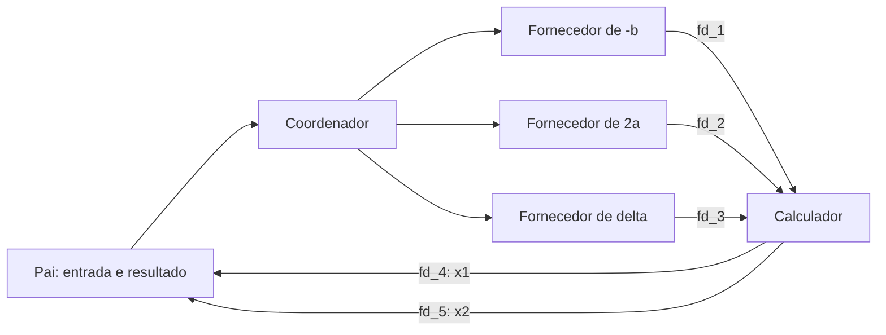

# Guia dos exemplos

## Processos: fork2.c

Todos os processos continuam o laço com três iterações de fork. Sem falhas, são criados oito processos no total, incluindo o original. Cada um coleta seus filhos diretos. O vetor começa zerado com calloc e as escritas dos filhos alteram suas próprias cópias.

Saída esperada: `Soma total no pai: 0`. Esperar pelos filhos não transforma o vetor em memória compartilhada.

## Comunicação: pipe2.c

O pai recebe a, b e delta antes da criação dos filhos. São seis processos e cinco pipes:

O pai também cria diretamente o calculador. As setas sem rótulo representam criação de processos; as rotuladas representam envio por pipe. Os dados são doubles binários entre processos locais, com tratamento de transferências parciais e EOF. Cada processo fecha pontas desnecessárias.

Entrada `1 -3 1` → raízes 1 e 2. Entrada `1 -2 0` → raiz dupla 1. Valores não finitos, a=0 e delta negativo são rejeitados. O exemplo calcula raízes reais diretamente pela fórmula de Bhaskara; pode haver perda de precisão numérica para coeficientes extremos. Não é um solucionador numérico de uso geral.

## Exclusão mútua: peterson-code.c

Duas threads executam 10.000 entradas cada. Os indicadores de interesse e a variável de desempate usam atomics C11. A string e o contador são acessados sob o protocolo de Peterson.

Saída final: `Contador: 20000 (esperado: 20000)`. A ordem das mensagens iniciais varia. Não há alternância obrigatória. O laço de espera consome CPU; o algoritmo serve aqui para ensinar exclusão mútua de dois participantes.

## Buffer limitado: prod_cons.c

Uma thread produz 40 números e outra consome 40, em ordem FIFO. O buffer tem 20 posições e índices circulares.

| Semáforo | Inicial | Finalidade |
|---|---:|---|
| mutex | 1 | Proteger buffer, índices e count |
| empty | 20 | Reservar vagas |
| full | 0 | Reservar itens |

Produtor: espera empty → espera mutex → insere → libera mutex → publica full.

Consumidor: espera full → espera mutex → retira → libera mutex → publica empty.

Esperar por disponibilidade antes do mutex permite que a outra thread modifique o buffer. Leituras de count nos logs estão protegidas. Após os joins, o buffer está vazio e os semáforos são destruídos. Números e intercalação dos logs variam.

## Monitores Java

Os fontes originais ficam em `Monitor-20261002T192224Z-1-001/Monitor`.

- **1 / Mailbox3b:** acessos sem sincronização; mensagens podem se misturar.
- **3 / Mailbox3s:** métodos synchronized e espera do consumidor por wait/notify; produtores ainda podem sobrescrever mensagem pendente.

wait libera o monitor associado e exige nova verificação da condição após acordar. notify não transfere imediatamente o lock. sleep não libera o monitor. As duas demonstrações são infinitas: interrompa com Ctrl+C.

A explicação detalhada dos originais e os exercícios estão no [guia do professor](../preparacao/GUIA_DO_PROFESSOR.md).
